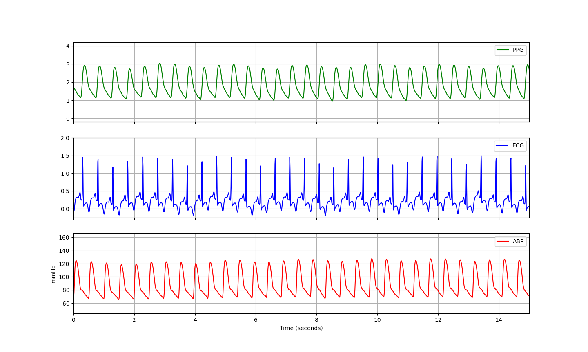
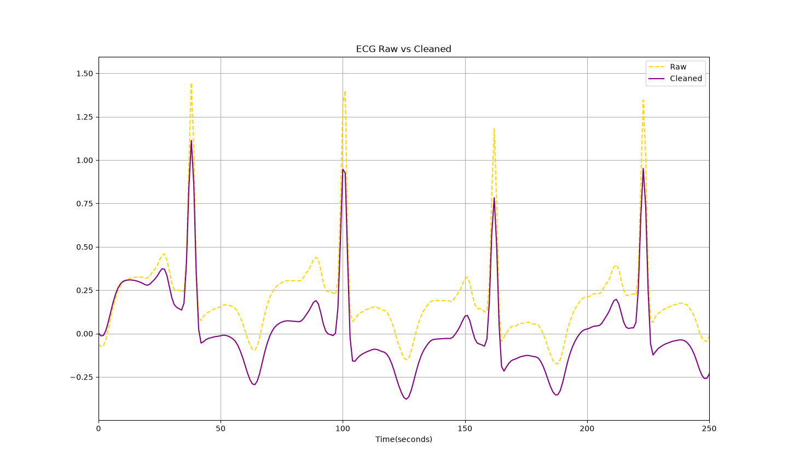

# BP Prediction from ECG and PPG features
- This project attempts to accurately predict systolic and diastolic blood pressure using ECG and PPG signals.
- The goal is to achieve continuous blood pressure monitoring without the need for invasive arterial lines or noninvasive cuffs.

#### Download the dataset from UCI Machine Learning Repo into 'data/raw'
- https://archive.ics.uci.edu/dataset/340/cuff+less+blood+pressure+estimation

#### Set up the virtual environment (Python 3.12)
```bash
python3 -m venv .venv
source .venv/bin/activate        # Windows: .venv\Scripts\activate
pip install -r requirements.txt
```


